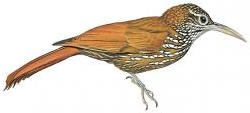

```{r, echo=FALSE, warning=FALSE}
library(knitr)
library(rmarkdown)

opts_chunk$set(cache=TRUE,
               root.dir="/Users/adamw/repos/hSDM_Tutorial",
               warning=FALSE,
               message=F,
               fig.width=15,fig.height=15)

# purl("R/hSDM_Tutorial.Rmd","R/hSDM_Tutorial.R",documentation=2)
# rmarkdown::render("R/hSDM_Tutorial.Rmd", "all")

```
# Introduction to hSDM

## Objectives

* Use opportunistic species occurrence data for occupancy modelling
* Use `hSDM` R package to fit hierarchical distribution model
* Compare output from models built with interpolated and satellite-derived environmental data

This script is available:

  * [hSDM Tutorial on GitHub](https://github.com/adammwilson/hSDM_Tutorial)
  * [HTML format with images/plots](https://rawgit.com/adammwilson/hSDM_Tutorial/master/R/hSDM_Tutorial.html)
  * [Plain text (.R) with commented text](https://raw.githubusercontent.com/adammwilson/hSDM_Tutorial/master/R/hSDM_Tutorial.R)

If you don't have the packages above, install them in the package manager or by running `install.packages("doParallel")`. 


# Species Distribution Modeling

Two major problems which can bias model results: 

1. imperfect (and spatially biased) detections
2. spatial correlation of the observations.

## Introduction to hSDM R Package

* User-friendly statistical functions to overcome limitations above.
* Developed in a hierarchical Bayesian framework. 
* Call a Metropolis-within-Gibbs algorithm (coded in C) to estimate model parameters and drastically the computation time compared to other methods (e.g. ~2-10x faster than OpenBUGS).

## The problem of imperfect detection

Site-occupancy models (MacKenzie et al., 2002, _aka_ zero inflated binomial (ZIB) models) for presence-absence data and Nmixture models (Royle, 2004) or zero inflated Poisson (ZIP) models for abundance data (Flores et al., 2009), were developed to solve the problems created by imperfect detection.


# Example application

## Load libraries
```{r loadLibraries,message=FALSE,warning=FALSE}
library(hSDM)
library(ggplot2)
library(rasterVis)
library(raster)
library(maptools)
library(dplyr)

library(coda)
library(doParallel)
ncores=2  # number of processor cores you would like to use
registerDoParallel(ncores)

## set light theme for ggplot
theme_set(theme_light()+theme(text=element_text(size = 32)))

```


__________

## Example Species: *Montane Woodcreeper* (_Lepidocolaptes lacrymiger_)


<br><span style="color:grey; font-size:1em;">Figure from [hbw.com](http://www.hbw.com/species/montane-woodcreeper-lepidocolaptes-lacrymiger) </span>

> This species has a large range, occurring from the coastal cordillera of Venezuela along the Andes south to south-east Peru and central Bolivia. [birdlife.org](http://www.birdlife.org/datazone/speciesfactsheet.php?id=31946)

```{r}
sp="Lepidocolaptes_lacrymiger"

## set path to data folder
datadir=paste0("../data/",sp,"/")

```


## Extract species 'expert range' via MOL.

```{r,eval=FALSE}
download.file(paste0("http://mol.cartodb.com/api/v2/sql?",
                     "q=SELECT%20ST_TRANSFORM(the_geom_webmercator,4326)%20as%20the_geom,%20seasonality%20FROM%20",
                     "get_tile('jetz','range','",
                     paste(strsplit(sp,"_")[[1]],collapse="%20"),
                     "','jetz_maps')&format=shp&filename=expert"),
              destfile=paste0(datadir,"expert.zip"))
unzip(paste0(datadir,"expert.zip"),exdir=datadir)
```

Load the expert range.
```{r}
reg=readShapePoly(paste0(datadir,"expert.shp"))
## extract bounding box of Expert Range
ereg=extent(reg)
## adjust bbox if desired
ereg@xmin=-81.4
```


## Query eBird data contained in MOL

* Find all observations of our species
* Find all unique observation locations for any species limited to bounding box of expert range
* Filter to where observer indicated recording all observed species (`all_species_reported='t'`)
* Filter to lists that do not correspond to an observation of our species

> The best method for selecting data to use for _non-detections_ is very case and dataset specific.

Metadata for eBird^[M. Arthur Munson, Kevin Webb, Daniel Sheldon, Daniel Fink, Wesley M. Hochachka, Marshall Iliff, Mirek Riedewald, Daria Sorokina, Brian Sullivan, Christopher Wood, and Steve Kelling. The eBird Reference Dataset, Version 5.0. Cornell Lab of Ornithology and National Audubon Society, Ithaca, NY, January 2013.] is [available here](http://ebirddata.ornith.cornell.edu/downloads/erd/ebird_all_species/erd_western_hemisphere_data_grouped_by_year_v5.0.tar.gz)

Below is an R function that queries the eBird data and summarized as bulleted above.  This database is not currently publically accessible, so we're providing the summarized data below.  

```{r, eval=FALSE}

# install_github("pingles/redshift-r")
getebird=function(con, sptaxon, region){
  print(paste("Extracting data, this can take a few minutes..."))
    dbGetQuery(conn,paste(   
        "WITH ebird_subset as (SELECT 
            all_species_reported,
            taxonomic_order,
            latitude,
            longitude,
            observation_date,
            sampling_event_identifier,
            group_identifier,
            effort_distance_km,
            effort_area_ha,
            duration_minutes
          FROM ebird
          WHERE latitude BETWEEN ",paste(bbox(region)["y",],collapse=" AND "),"
          AND longitude BETWEEN ",paste(bbox(region)["x",],collapse=" AND "),")
        presence as (SELECT DISTINCT 
            latitude,
            longitude,
            observation_date,
            sampling_event_identifier,
            group_identifier,
            effort_distance_km,
            effort_area_ha,
            duration_minutes,
            1 AS presence
          FROM ebird_subset
          WHERE floor(taxonomic_order) IN (",paste(sptaxon,collapse=","),"))
          absence as (SELECT DISTINCT
            latitude,
            longitude,
            observation_date,
            sampling_event_identifier,
            group_identifier,
            effort_distance_km,
            effort_area_ha,
            duration_minutes,
            0 AS presence
          FROM ebird_subset
          WHERE all_species_reported='t'
          AND sampling_event_identifier NOT IN (SELECT
            sampling_event_identifier FROM presence))
          SELECT 
            latitude,
            longitude,
            observation_date,
            presence,
            effort_distance_km,
            duration_minutes,
            effort_area_ha 
          FROM presence
         UNION
          SELECT
              latitude,
              longitude,
              observation_date,
              presence,
              effort_distance_km,
              duration_minutes,
              effort_area_ha 
          FROM absence"))
    }
```


Use the `getebird()` function to query the database and return the summarized data frame.
```{r, eval=FALSE}
## get species data
require(redshift)
rs_url="jdbc:postgresql://***redshift.amazonaws.com:5439/mol?tcpKeepAlive=true"

conn <- redshift.connect(rs_url)

spd_all=getebird(
  con=conn,
  sptaxon=sptaxon,
  nulltaxon=NULL,
  region=reg
  )

```

## Clean up the observational data

Load the table created in the step above. These data are available in the public DropBox folder.
```{r loadSpd}
spd_all=read.csv(paste0(datadir,sp,"_points.csv"))
```


Check out the data structure from the SQL query:
```{r headSpd, results='asis'}
kable(head(spd_all[,-1]))
```

Explore  observer effort: sampling duration, distance travelled, and area surveyed.
```{r spdDurationPlot}
cdur=4*60
cdis=5
care=500

ggplot(spd_all,aes(
  y=duration_minutes/60,
  x=effort_distance_km,
  colour=presence==1,
  order=as.factor(presence)))+
  ylab("Sampling Duration (hours)")+
  xlab("Sampling Distance (km)")+
  labs(col = "Observed\nPresence")+
  geom_point()+scale_x_log10()+
  geom_vline(xintercept=cdis)+geom_hline(yintercept=cdur/60)
```


Also note that there are many records with missing duration and distance values.
```{r spNA}
table("Duration"=!is.na(spd_all$duration_minutes),
      "Distance/Area"=!is.na(spd_all$effort_distance_km)|
        !is.na(spd_all$effort_area_ha))
```

> For this exercise, we'll simply remove points with large or unknown spatial uncertainty.  Incorporating this spatial uncertainty into distribution models is an active area of research.


Filter the data below thresholds specified above.
```{r filterSpd}
spd=filter(spd_all,duration_minutes<=cdur&
             (effort_distance_km<=cdis|effort_area_ha<=care))
```


Convert to a spatialDataFrame to faciliate linking with georeferenced environmental data.

```{r spSpd}
coordinates(spd)=c("longitude","latitude")
projection(spd)="+proj=longlat +datum=WGS84 +ellps=WGS84"
spd@data[,c("lon","lat")]=coordinates(spd)  
```

### Load coastline from maptools packge for plotting.
```{r loadCoast}
coast <- map_data("world",
                  xlim=c(ereg@xmin-1,ereg@xmax+1),
                  ylim=c(ereg@ymin-1,ereg@ymax+1))
ggcoast=geom_path(data=coast,aes(x=long,y=lat,group = group),lwd=.1)

## set plotting limits
gx=xlim(ereg@xmin-1,ereg@xmax+1)
gy=ylim(ereg@ymin-1,ereg@ymax+1)

```

## Available Species Data
```{r spdPlot, message=FALSE}
ggplot(spd@data,aes(y=lat,x=lon))+
  geom_path(data=fortify(reg),aes(y=lat,x=long,group=piece),fill="green",col="green")+
  geom_point(aes(colour=presence>=1,order=as.factor(presence)))+
  ggcoast+gx+gy+ylab("Latitude")+xlab("Longitude")+
  labs(col = "Species\nObserved")+
  coord_equal()

```

______________________


## Environmental Data
```{r loadEnv}
env=stack(paste0(datadir,sp,"env.tif"))
names(env)=c("PPTJAN","PPTJUL","PPTSEAS","MAT","ALT","CLDJAN","CLDJUL","CLDSEAS")
```

### Scale environmental data
Scaling covariate data results in standardized parameter values and also can speed up modeling convergence.  It's possible to _unscale_ the results later if desired.

```{r scaleEnv}
cmeans=cellStats(env,"mean")
csd=cellStats(env,"sd")
## Create a 'scaled' version for modelling
senv=raster::scale(env)
```

### Intersect environmental data
```{r gridSpd}  
## add cell id to facilitate linking points to raster
cell=env[[1]]
raster::values(cell)=1:ncell(cell)
names(cell)="cell"

## rasterize points
presences=rasterize(spd,env,fun="sum",field="presence",background=0)
trials=rasterize(spd,env,fun="count",field="presence",background=0)
```

```{r plotEnv}
## Environmental data
gplot(senv)+
  geom_raster(aes(fill=value)) + 
  facet_wrap(~variable,nrow=2) +
  scale_fill_gradientn(colours=c('blue','white','red','darkred'),breaks=c(-3,0,3,6),na.value="transparent")+
  ylab("")+xlab("")+labs(fill = "Standardized\nValue")+
  ggcoast+gx+gy
```
### Covariate correlation
```{r envCor}
splom(senv,varname.cex=2)
```

### Generate data for model fitting
```{r spdReformat}
data=cbind.data.frame(
  coordinates(senv),
  trials=values(trials),
  presences=values(presences),
  cell=values(cell),
  values(senv))

## omit rows with missing data (primarily ocean pixels)
data=na.omit(data)

kable(head(data))
```

### Select data for fitting
Due to opportunistic observations, there are a few sites with more presences than trials. Let's remove:


```{r MakeFittingdata}
data$fit=ifelse(
    data$trials>0 & 
    data$trials>=data$presences,
  1,0)
## create 'fitting' dataset where there are observations
fdata=data[data$fit>0,]
```

## Model Comparison
Let's compare two models, one using interpolated precipitation and the other using satellite-derived cloud data.

```{r modelNames}
# Set number of chains to fit.
mods=data.frame(
  model=c("m1","m2"),
  formula=c("~PPTJAN+PPTJUL+PPTSEAS+MAT",
            "~CLDJAN+CLDJUL+CLDSEAS+MAT"),
  name=c( "Precipitation",
          "Cloud"))

kable(mods)
```

Specify model run-lengths.  
```{r modelSetup}
burnin=1000
mcmc=1000
thin=1
```

```{r runmodel}
results=foreach(m=1:nrow(mods)) %dopar% { 
  ## if foreach/doParallel are not installed, you can use this line instead
  # for(m in 1:nrow(mods)) { 
  tres=hSDM.ZIB(
    suitability=as.character(mods$formula[m]),
    presences=fdata$presences,
    observability=~1,
    mugamma=0, Vgamma=1.0E6,
    gamma.start=0,
    trials=fdata$trials,
    data=fdata,
    burnin=burnin, mcmc=mcmc, thin=thin,
    beta.start=0,
    suitability.pred=data,
    mubeta=0, Vbeta=1.0E6,
    save.p=0,
    verbose=1,
    seed=round(runif(1,0,1e6)))
  tres$model=mods$formula[m]
  tres$modelname=mods$name[m]
  return(tres)
  }

```

## Summarize posterior parameters
```{r}
params=foreach(r1=results,.combine=rbind.data.frame)%do% {
  data.frame(model=r1$model,
             parameter=colnames(r1$mcmc),
             mean=summary(r1$mcmc)$statistics[,"Mean"],
             sd=summary(r1$mcmc)$statistics[,"SD"],
             median=summary(r1$mcmc)$quantiles[,"50%"],
             HPDinterval(mcmc(as.matrix(r1$mcmc))),
             RejectionRate=rejectionRate(r1$mcmc))}

## plot it
params2=params[!grepl("Deviance*",rownames(params)),]
ggplot(params2,aes(x=mean,y=parameter,colour=model))+
  geom_point()+
  geom_errorbarh(aes(xmin=lower,xmax=upper,height=.1))

```

## Predictions for each cell
```{r}

pred=foreach(r1=results,.combine=stack)%dopar% {
  tr=rasterFromXYZ(cbind(x=data$x,
                         y=data$y,
                         pred=r1$prob.p.pred))
  names(tr)=r1$modelname    
  return(tr)
  }
```

Compare the model predictions
```{r plotmodel}

predscale=scale_fill_gradientn(values=c(0,.5,1),colours=c('white','darkgreen','green'),na.value="transparent")

gplot(pred)+geom_raster(aes(fill=value)) +
  facet_wrap(~ variable) +
  predscale+
  coord_equal()
```

## Summary

In this session, we illustrated:

* Used opportunistic species occurrence data and `hSDM` to fit an occupancy model
* Compared output from models built with interpolated and satellite-derived environmental data
