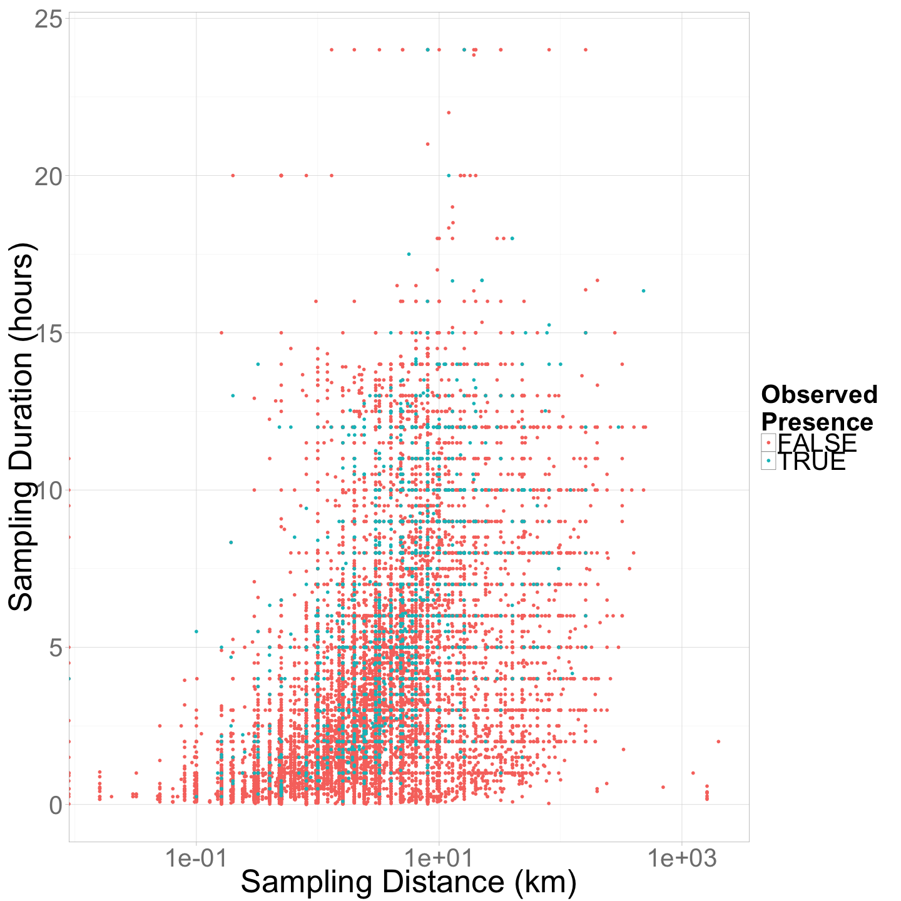
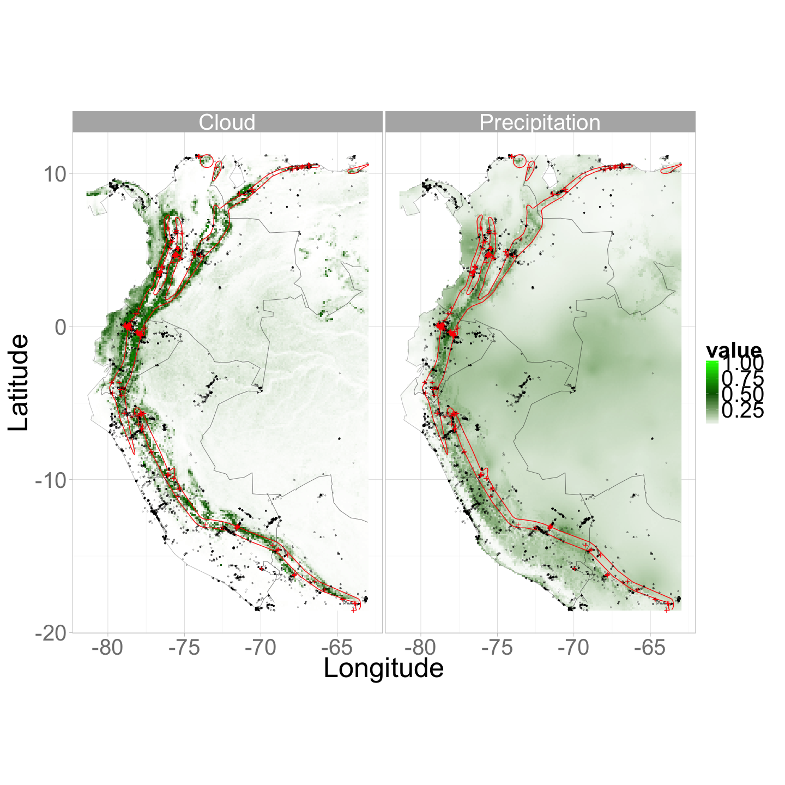

Introduction to hSDM
====================

Objectives
----------

-   Use opportunistic species occurrence data for occupancy modelling
-   Use `hSDM` R package to fit hierarchical distribution model
-   Compare output from models built with interpolated and satellite-derived environmental data

This script is available:

-   [hSDM Tutorial (<https://github.com/adammwilson/hSDM_Tutorial>)](On%20GitHub)
-   [HTML format (with images/plots)](https://rawgit.com/adammwilson/hSDM_Tutorial/master/R/hSDM_Tutorial.html)
-   [Plain text (.R) with commented text](https://raw.githubusercontent.com/adammwilson/hSDM_Tutorial/master/R/hSDM_Tutorial.R)

If you don't have the packages above, install them in the package manager or by running `install.packages("doParallel")`.

Species Distribution Modeling
=============================

Two major problems which can bias model results:

1.  imperfect (and spatially biased) detections
2.  spatial correlation of the observations.

Introduction to hSDM R Package
------------------------------

-   User-friendly statistical functions to overcome limitations above.
-   Developed in a hierarchical Bayesian framework.
-   Call a Metropolis-within-Gibbs algorithm (coded in C) to estimate model parameters and drastically the computation time compared to other methods (e.g. \~2-10x faster than OpenBUGS).

The problem of imperfect detection
----------------------------------

Site-occupancy models (MacKenzie et al., 2002, *aka* zero inflated binomial (ZIB) models) for presence-absence data and Nmixture models (Royle, 2004) or zero inflated Poisson (ZIP) models for abundance data (Flores et al., 2009), were developed to solve the problems created by imperfect detection.

Example application
===================

Load libraries
--------------

``` {.r}
library(hSDM)
library(ggplot2)
library(rasterVis)
library(raster)
library(maptools)
library(dplyr)

library(coda)
library(doParallel)
ncores=2  # number of processor cores you would like to use
registerDoParallel(ncores)

## set light theme for ggplot
theme_set(theme_light())
```

Select Species
--------------

For this example we'll work with the Montane Woodcreeper (*Lepidocolaptes lacrymiger*).

 <span style="color:grey; font-size:1em;">Figure from [here](http://www.hbw.com/species/montane-woodcreeper-lepidocolaptes-lacrymiger) </span>

``` {.r}
sp="Lepidocolaptes_lacrymiger"

## set path to data folder
datadir=paste0("../data/",sp,"/")
```

Species 'expert range' via MOL.
-------------------------------

``` {.r}
download.file(paste0("http://mol.cartodb.com/api/v2/sql?",
                     "q=SELECT%20ST_TRANSFORM(the_geom_webmercator,4326)%20as%20the_geom,%20seasonality%20FROM%20",
                     "get_tile('jetz','range','",
                     paste(strsplit(sp,"_")[[1]],collapse="%20"),
                     "','jetz_maps')&format=shp&filename=expert"),
              destfile=paste0(datadir,"expert.zip"))
unzip(paste0(datadir,"expert.zip"),exdir=datadir)
```

Load the expert range.

``` {.r}
reg=readShapePoly(paste0(datadir,"expert.shp"))
## extract bounding box of Expert Range
ereg=extent(reg)
## adjust bbox if desired
ereg@xmin=-81.4
```

Query eBird data contained in MOL
---------------------------------

-   Find all observations of our species
-   Find all unique eBird observation locations
-   Within bounding box of expert range
-   Observer indicated that they recorded all observed species (`all_species_reported='t'`)
-   Do not correspond to an observation of our species

> Discuss future availability of tools like this in MOL

Metadata for eBird[1] is [available here](http://ebirddata.ornith.cornell.edu/downloads/erd/ebird_all_species/erd_western_hemisphere_data_grouped_by_year_v5.0.tar.gz)

Below is an R function that queries the eBird data and summarized as bulleted above. This database is not currently publically accessible, so we're providing the summarized data below.

``` {.r}
# install_github("pingles/redshift-r")
getebird=function(con, sptaxon, nulltaxon=NULL,region){
  print(paste("Extracting data, this can take a few minutes..."))
  if(!is.null(nulltaxon)){  #return only species in list as 'non-detection'
    dbGetQuery(conn, 
               paste(   
                 "WITH ebird_subset as (SELECT all_species_reported,taxonomic_order,latitude,longitude,observation_date,sampling_event_identifier,group_identifier,effort_distance_km,effort_area_ha,duration_minutes",
                 "FROM ebird",
                 "WHERE latitude BETWEEN ",paste(bbox(region)["y",],collapse=" AND "),
                 "AND longitude BETWEEN ",paste(bbox(region)["x",],collapse=" AND "),
                 "AND floor(taxonomic_order) IN (",paste(c(sptaxon,nulltaxon),collapse=","),")),",
                 "presence as (SELECT DISTINCT latitude,longitude,observation_date,sampling_event_identifier,group_identifier,effort_distance_km,effort_area_ha,duration_minutes,1 AS presence ",
                 "FROM ebird_subset",
                 "WHERE floor(taxonomic_order) IN (",paste(sptaxon,collapse=","),")),",
                 "absence as (SELECT DISTINCT latitude,longitude,observation_date,sampling_event_identifier,group_identifier,effort_distance_km,effort_area_ha,duration_minutes,0 AS presence",
                 "FROM ebird_subset",
                 "WHERE all_species_reported='t'",
                 "AND sampling_event_identifier NOT IN (SELECT sampling_event_identifier FROM presence))",
                 "SELECT latitude,longitude,observation_date,presence,effort_distance_km,effort_area_ha,duration_minutes FROM presence",
                 "UNION",
                 "SELECT latitude,longitude,observation_date,presence,effort_distance_km,effort_area_ha,duration_minutes FROM absence"))
    }
  if(is.null(nulltaxon)){  ## return all species as 'non-detections'
    dbGetQuery(conn, 
               paste(   
                 "WITH ebird_subset as (SELECT all_species_reported,taxonomic_order,latitude,longitude,observation_date,sampling_event_identifier,group_identifier,effort_distance_km,effort_area_ha,duration_minutes",
                 "FROM ebird",
                 "WHERE latitude BETWEEN ",paste(bbox(region)["y",],collapse=" AND "),
                 "AND longitude BETWEEN ",paste(bbox(region)["x",],collapse=" AND "),"),",
                 "presence as (SELECT DISTINCT latitude,longitude,observation_date,sampling_event_identifier,group_identifier,effort_distance_km,effort_area_ha,duration_minutes,1 AS presence ",
                 "FROM ebird_subset",
                 "WHERE floor(taxonomic_order) IN (",paste(sptaxon,collapse=","),")),",
                 "absence as (SELECT DISTINCT latitude,longitude,observation_date,sampling_event_identifier,group_identifier,effort_distance_km,effort_area_ha,duration_minutes,0 AS presence",
                 "FROM ebird_subset",
                 "WHERE all_species_reported='t'",
                 "AND sampling_event_identifier NOT IN (SELECT sampling_event_identifier FROM presence))",
                 "SELECT latitude,longitude,observation_date,presence,effort_distance_km,duration_minutes,effort_area_ha FROM presence",
                 "UNION",
                 "SELECT latitude,longitude,observation_date,presence,effort_distance_km,duration_minutes,effort_area_ha FROM absence"))
    }
  }
```

Use the `getebird()` function to query the database and return the summarized data frame.

``` {.r}
## get species data
require(redshift)
rs_url="jdbc:postgresql://mol-points.c98tkbi1cfwj.us-east-1.redshift.amazonaws.com:5439/mol?tcpKeepAlive=true"

conn <- redshift.connect(rs_url)

spd_all=getebird(
  con=conn,
  sptaxon=sptaxon,
  nulltaxon=NULL,
  region=reg)
```

Clean up the observational data
-------------------------------

Load the table created in the step above.

``` {.r}
spd_all=read.csv(paste0(datadir,sp,"_points.csv"))
```

Explore observer effort: sampling duration, distance travelled, and area surveyed.

``` {.r}
cdur=4*60
cdis=5
care=500

ggplot(spd_all,aes(
  y=duration_minutes/60,
  x=effort_distance_km,
  colour=presence==1,
  order=as.factor(presence)))+
  ylab("Sampling Duration (hours)")+
  xlab("Sampling Distance (km)")+
  labs(col = "Observed\nPresence")+
  geom_point()+scale_x_log10()+
  geom_vline(xintercept=cdis)+geom_hline(yintercept=cdur/60)
```



Also note that there are many records with missing duration and distance values.

``` {.r}
table("Duration"=!is.na(spd_all$duration_minutes),
      "Distance/Area"=!is.na(spd_all$effort_distance_km)|
        !is.na(spd_all$effort_area_ha))
```

    ##         Distance/Area
    ## Duration FALSE  TRUE
    ##    FALSE 13280    93
    ##    TRUE   6713 26842

> For this exercise, we'll simply remove points with large or unknown spatial uncertainty.

``` {.r}
spd=filter(spd_all,duration_minutes<=cdur&
             (effort_distance_km<=cdis|effort_area_ha<=care))
```

Convert to a spatialDataFrame to faciliate linking with georeferenced environmental data.

``` {.r}
coordinates(spd)=c("longitude","latitude")
projection(spd)="+proj=longlat +datum=WGS84 +ellps=WGS84"
spd@data[,c("lon","lat")]=coordinates(spd)  
```

### Load coastline for plotting

``` {.r}
coast <- map_data("world",
                  xlim=c(ereg@xmin-1,ereg@xmax+1),
                  ylim=c(ereg@ymin-1,ereg@ymax+1))
ggcoast=geom_path(data=coast,aes(x=long,y=lat,group = group),lwd=.2)

## set plotting limits
gx=xlim(ereg@xmin-1,ereg@xmax+1)
gy=ylim(ereg@ymin-1,ereg@ymax+1)
```

Available Species Data
----------------------

``` {.r}
ggplot(spd@data,aes(y=lat,x=lon))+
  geom_path(data=fortify(reg),aes(y=lat,x=long,group=piece),fill="green",col="green")+
  geom_point(aes(colour=as.factor(presence),order=as.factor(presence)))+
  ggcoast+gx+gy+ylab("Latitude")+xlab("Longitude")+
  labs(col = "Observed\nPresence")
```

    ## Regions defined for each Polygons


### Load Environmental Data

``` {.r}
env=stack(paste0(datadir,sp,"env.tif"))
names(env)=c("PPTJAN","PPTJUL","PPTSEAS","MAT","ALT","CLDJAN","CLDJUL","CLDSEAS")
```

Scale environmental data
------------------------

Scaling covariate data results in standardized parameter values and also can speed up modeling convergence. It's possible to *unscale* the results later if desired.

``` {.r}
cmeans=cellStats(env,"mean")
csd=cellStats(env,"sd")
## Create a 'scaled' version for modelling
senv=raster::scale(env)
```

### Intersect Environmental data

``` {.r}
## add cell id to facilitate linking points to raster
cell=env[[1]]
raster::values(cell)=1:ncell(cell)
names(cell)="cell"

## rasterize points
presences=rasterize(spd,env,fun="sum",field="presence",background=0)
trials=rasterize(spd,env,fun="count",field="presence",background=0)
```

``` {.r}
## Environmental data
gplot(senv,maxpixels=1e4)+
  geom_raster(aes(fill=value)) + 
  facet_wrap(~variable,nrow=2) +
  scale_fill_gradientn(colours=c('blue','white','red'),breaks=c(-3,0,3,6),na.value="transparent")+
  ylab("")+xlab("")+labs(fill = "Standardized\nValue")+
  ggcoast+gx+gy
```

 \#\# Covariate correlation

``` {.r}
tcor=layerStats(senv, "pearson",asSample=F, na.rm=T)
kable(tcor[[1]])
```

||PPTJAN|PPTJUL|PPTSEAS|MAT|ALT|CLDJAN|CLDJUL|CLDSEAS|
|---|-----:|-----:|------:|--:|--:|-----:|-----:|------:|
|PPTJAN|0.9999998|-0.2691580|-0.3702433|0.1596282|-0.1920276|0.4183881|-0.1537030|0.0660666|
|PPTJUL|-0.2691580|0.9999998|-0.3508095|0.4046315|-0.3651638|-0.1971537|0.5655739|-0.5360878|
|PPTSEAS|-0.3702433|-0.3508095|0.9999998|-0.3956673|0.3806978|-0.1973561|-0.5168914|0.5564869|
|MAT|0.1596282|0.4046315|-0.3956673|0.9999998|-0.9842515|-0.1506436|0.3219791|-0.3187198|
|ALT|-0.1920276|-0.3651638|0.3806978|-0.9842515|0.9999998|0.1498754|-0.2819983|0.3045607|
|CLDJAN|0.4183881|-0.1971537|-0.1973561|-0.1506436|0.1498754|0.9999999|-0.1512874|-0.4443342|
|CLDJUL|-0.1537030|0.5655739|-0.5168914|0.3219791|-0.2819983|-0.1512874|0.9999999|-0.3576120|
|CLDSEAS|0.0660666|-0.5360878|0.5564869|-0.3187198|0.3045607|-0.4443342|-0.3576120|0.9999999|

``` {.r}
data=cbind.data.frame(
  coordinates(senv),
  trials=values(trials),
  presences=values(presences),
  cell=values(cell),
  values(senv))

## omit rows with missing data
data=na.omit(data)

kable(head(data))
```

||x|y|trials|presences|cell|PPTJAN|PPTJUL|PPTSEAS|MAT|ALT|CLDJAN|CLDJUL|CLDSEAS|
|---|--:|--:|-----:|--------:|---:|-----:|-----:|------:|--:|--:|-----:|-----:|------:|
|859|-74.24583|11.22083|0|0|859|-1.423799|-0.8140504|0.9764176|0.8416604|-0.6208328|-3.099071|-0.5569284|1.625808|
|860|-74.23750|11.22083|0|0|860|-1.423799|-0.8069300|0.9400721|0.8250522|-0.6182952|-3.094218|-0.5344020|1.728785|
|861|-74.22917|11.22083|0|0|861|-1.406864|-0.7072447|0.9037265|0.7254033|-0.5345561|-3.119565|-0.4127595|1.839334|
|862|-74.22083|11.22083|0|0|862|-1.389928|-0.6075594|0.9400721|0.6423625|-0.4761925|-3.097453|-0.1899985|2.007428|
|863|-74.21250|11.22083|0|0|863|-1.415331|-0.7855689|0.9037265|0.8250522|-0.6115284|-3.126577|0.1173617|2.305759|
|864|-74.20417|11.22083|0|0|864|-1.415331|-0.7784485|0.9037265|0.8250522|-0.6106826|-3.105004|0.2700406|2.475368|

### Select data for fitting

Due to opportunistic observations, there are a few sites with more presences than trials. Let's remove:

``` {.r}
data$fit=ifelse(
  data$trials>0 & data$trials>=data$presences,
  1,0)
## create 'fitting' dataset where there are observations
fdata=data[data$fit>0,]
```

``` {.r}
# Set number of chains to fit.
mods=data.frame(
  model=c("m1","m2"),
  formula=c("~PPTJAN+PPTJUL+PPTSEAS+MAT",
            "~CLDJAN+CLDJUL+CLDSEAS+MAT"),
  name=c( "Precipitation",
          "Cloud"))

kable(mods)
```

|model|formula|name|
|:----|:------|:---|
|m1|\~PPTJAN+PPTJUL+PPTSEAS+MAT|Precipitation|
|m2|\~CLDJAN+CLDJUL+CLDSEAS+MAT|Cloud|

``` {.r}
burnin=1000
mcmc=1000
thin=1
```

``` {.r}
results=foreach(m=1:nrow(mods)) %dopar% { 
  ## if foreach/doParallel are not installed, you can use this line instead
  # for(m in 1:nrow(mods)) { 
  tres=hSDM.ZIB(
    suitability=as.character(mods$formula[m]),
    presences=fdata$presences,
    observability=~1,
    mugamma=0, Vgamma=1.0E6,
    gamma.start=0,
    trials=fdata$trials,
    data=fdata,
    burnin=burnin, mcmc=mcmc, thin=thin,
    beta.start=0,
    suitability.pred=data,
    mubeta=0, Vbeta=1.0E6,
    save.p=0,
    verbose=1,
    seed=round(runif(1,0,1e6)))
  tres$model=mods$formula[m]
  tres$modelname=mods$name[m]
  return(tres)
  }
```

Summarize posterior parameters
------------------------------

``` {.r}
params=foreach(r1=results,.combine=rbind.data.frame)%do% {
  data.frame(model=r1$model,
             parameter=colnames(r1$mcmc),
             mean=summary(r1$mcmc)$statistics[,"Mean"],
             sd=summary(r1$mcmc)$statistics[,"SD"],
             median=summary(r1$mcmc)$quantiles[,"50%"],
             HPDinterval(mcmc(as.matrix(r1$mcmc))),
             RejectionRate=rejectionRate(r1$mcmc))}

## plot it
params2=params[!grepl("Deviance*",rownames(params)),]
ggplot(params2,aes(x=mean,y=parameter,colour=model))+
  geom_point()+
  geom_errorbarh(aes(xmin=lower,xmax=upper,height=.1))
```


Predictions for each cell
-------------------------

``` {.r}
pred=foreach(r1=results,.combine=stack)%do% {
  tr=rasterFromXYZ(cbind(x=data$x,
                         y=data$y,
                         pred=r1$prob.p.pred))
  names(tr)=r1$model    
  return(tr)
  }
```

Compare the model predictions

``` {.r}
predscale=scale_fill_gradientn(values=c(0,.5,1),colours=c('white','darkgreen','green'),na.value="transparent")

gplot(pred)+geom_raster(aes(fill=value)) +
  facet_wrap(~ variable) +
  predscale+
  coord_equal()
```



Summary
-------

In this session, we illustrated:

-   Used opportunistic species occurrence data and `hSDM` to fit an occupancy model
-   Compared output from models built with interpolated and satellite-derived environmental data

[1] M. Arthur Munson, Kevin Webb, Daniel Sheldon, Daniel Fink, Wesley M. Hochachka, Marshall Iliff, Mirek Riedewald, Daria Sorokina, Brian Sullivan, Christopher Wood, and Steve Kelling. The eBird Reference Dataset, Version 5.0. Cornell Lab of Ornithology and National Audubon Society, Ithaca, NY, January 2013.
