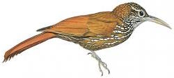

```{r, echo=FALSE, warning=FALSE, cache=FALSE}
library(knitr)
library(rmarkdown)

opts_chunk$set(cache=TRUE,
               root.dir="/Users/adamw/repos/hSDM_Tutorial",
               warning=FALSE,
               message=F,
               fig.width=15,
               fig.height=15)

## set light theme for ggplot
library(ggplot2)
theme_set(theme_light()+
            theme(text=element_text(size = 38)))

# purl("hSDM_Tutorial.Rmd","hSDM_Tutorial.R",documentation=2)
```
# Introduction to hSDM

## Objectives

* Use opportunistic species occurrence data for occupancy modelling
* Use `hSDM` R package to fit hierarchical distribution model
* Compare output from models built with interpolated and satellite-derived environmental data

> One could easily teach an full semester course on the use of this package and modelling framework.  Today we will provide only a quick introduction.

This script is available:

  * [MD format with images/plots](https://github.com/adammwilson/hSDM_Tutorial/blob/master/hSDM_Tutorial.md)
  * [Plain text (.R) with commented text](https://raw.githubusercontent.com/adammwilson/hSDM_Tutorial/master/hSDM_Tutorial.R)

You are welcome to follow along on the screen or download the R script and run it on your computer. 

The data used below are available in a [public dropbox folder](https://www.dropbox.com/sh/2q0k7qn5rxz0bis/AAB42fVn-s4Teqynrs6rgzR3a?dl=0), though they will be downloaded using code below.  You may want to download them now by visiting

# Species Distribution Modeling

Two important problems which can bias model results: 

1. imperfect detections ("false absences")
2. spatial correlation of the observations.

## hSDM R Package

Developed by [Ghislain Vieilledent](mailto:ghislain.vieilledent@cirad.fr) with Cory Merow, Jérôme Guélat, Andrew M. Latimer, Marc Kéry, Alan E. Gelfand, Adam M. Wilson, Frédéric Mortier & John A. Silander Jr

* User-friendly statistical functions to overcome limitations above.
* Developed in a hierarchical Bayesian framework. 
* Call a Metropolis-within-Gibbs algorithm (coded in C) to estimate model parameters and drastically the computation time compared to other methods (e.g. ~2-10x faster than OpenBUGS).

### Software for modeling species distribution including imperfect detection.


## The problem of imperfect detection

Site-occupancy models (MacKenzie et al., 2002, _aka_ zero inflated binomial (ZIB) models) for presence-absence data and Nmixture models (Royle, 2004) or zero inflated Poisson (ZIP) models for abundance data (Flores et al., 2009), were developed to solve the problems created by imperfect detection.

_________________

# Example application

## Load libraries
```{r loadLibraries,message=FALSE,warning=FALSE}
packages=c("hSDM","ggplot2","rasterVis","maptools","maps","dplyr","coda","doParallel","knitr","markdown","rgdal")

needpackages=packages[!packages%in%rownames(installed.packages())]
lapply(needpackages,install.packages)
lapply(packages, require, character.only=T)


ncores=2  # number of processor cores you would like to use
registerDoParallel(ncores)


```
If you don't have the packages above, install them in the package manager or by running `install.packages("doParallel")`. 

__________

## Example Species: *Montane Woodcreeper* (_Lepidocolaptes lacrymiger_)



<br><span style="color:grey; font-size:1em;">Figure from [hbw.com](http://www.hbw.com/species/montane-woodcreeper-lepidocolaptes-lacrymiger) </span>

> This species has a large range, occurring from the coastal cordillera of Venezuela along the Andes south to south-east Peru and central Bolivia. [birdlife.org](http://www.birdlife.org/datazone/speciesfactsheet.php?id=31946)


<br><span style="color:grey; font-size:1em;">Data via [MOL.org](http://map.mol.org/maps/Lepidocolaptes%20lacrymiger) </span>


Set species name:
```{r}
sp="Lepidocolaptes_lacrymiger"
```

## Data Directory
The script below will download data to the directory specified below.  Feel free to change it as desired.
```{r}
## set working directory and path where you want to download data
## you may want to change this to your home directory or elsewhere
datadir=paste0("hSDM_Tutorialdata/")
if(!file.exists(datadir)) dir.create(datadir,recursive = T)

setwd(datadir)
```


## Extract species 'expert range' via MOL.

```{r getRange}
fExpertRange=paste0(sp,".shp")
if(!file.exists(fExpertRange)){
  download.file(paste0("http://mol.cartodb.com/api/v2/sql?",
                     "q=SELECT%20ST_TRANSFORM(the_geom_webmercator,4326)%20as%20the_geom,",
                     "%20seasonality%20FROM%20get_tile('jetz','range','",
                     paste(strsplit(sp,"_")[[1]],collapse="%20"),
                     "','jetz_maps')&format=shp&filename=",sp),
              destfile=sub("shp","zip",fExpertRange),mode="wb")
  unzip(sub("shp","zip",fExpertRange))
}
```

> Full documentation and release of the MOL API in the works.

Load the expert range from the downloaded shapefile.
```{r readRange}
reg=readShapePoly(fExpertRange)
## extract bounding box of Expert Range
ereg=extent(reg)
## adjust bbox if desired
ereg@xmin=-81.4
```


## Query eBird data contained in MOL

* Find all observations of our species
* Find all unique observation locations for any species limited to bounding box of expert range
* Filter to where observer indicated recording all observed species (`all_species_reported='t'`)
* Filter to lists that do not correspond to an observation of our species

> The best method for selecting data to use for _non-detections_ is very case and dataset specific.

Metadata for eBird^[M. Arthur Munson, Kevin Webb, Daniel Sheldon, Daniel Fink, Wesley M. Hochachka, Marshall Iliff, Mirek Riedewald, Daria Sorokina, Brian Sullivan, Christopher Wood, and Steve Kelling. The eBird Reference Dataset, Version 5.0. Cornell Lab of Ornithology and National Audubon Society, Ithaca, NY, January 2013.] is [available here](http://ebird.org/ebird/data/download)

For this example we'll use data that has been precompiled using the criteria above.

## Download species occurrence data

We've made this exampled dataset available _via_ the DropBox links below.  If you have the `RCurl` package installed, the following commands should run. If these do not work, [you can also download these datasets from here](https://www.dropbox.com/sh/2q0k7qn5rxz0bis/AAB42fVn-s4Teqynrs6rgzR3a?dl=0).

```{r loadSpd}
fspData="Lepidocolaptes_lacrymiger_points_env.csv"

if(!file.exists(fspData)) {
    URL <- paste0("https://www.dropbox.com/s/1jsyl0xkxnzk20k/",
                  "Lepidocolaptes_lacrymiger_points_env.csv?dl=1")

    download.file(URL,
              destfile=fspData,method="curl",
              mode="wb",extra='-L')
}

spd_all=read.csv(fspData)
```

> If you have trouble with the download, you can also download these files via the [DropBox website](https://www.dropbox.com/sh/2q0k7qn5rxz0bis/AAB42fVn-s4Teqynrs6rgzR3a?dl=0) and put them in your current working directory specified above.  Then run the `read.csv(...)` command above.  You will likely also need to do this for the environmental data below.


Check out the data structure:
```{r headSpd, results='asis'}
kable(head(spd_all[,-1]))
```

Explore  observer effort: sampling duration, distance travelled, and area surveyed.
```{r spdDurationPlot,fig.width=10,fig.height=7}
ggplot(spd_all,aes(
  y=duration_minutes/60,
  x=effort_distance_km,
  colour=presence==1,
  order=as.factor(presence)))+
  scale_colour_manual(values=c("grey","red"))+
  ylab("Sampling Duration\n(hours)")+
  xlab("Sampling Distance (km)")+
  labs(colour = "Observed\nPresence")+
  geom_point()+scale_x_log10()
```


Also note that there are many records with missing duration and distance values.
```{r spNA}
table("Duration"=!is.na(spd_all$duration_minutes),
      "Distance/Area"=!is.na(spd_all$effort_distance_km)|
        !is.na(spd_all$effort_area_ha))
```

> For this exercise, we'll simply remove points with large or unknown spatial uncertainty.  Incorporating this spatial uncertainty into distribution models is an active area of research.


Filter the data below thresholds specified above.
```{r filterSpd}

cdur=4*60  # Duration in minutes
cdis=5     # Distance in km
care=500   # Area in Hectares
 
spd=filter(spd_all,
           duration_minutes<=cdur&
          (effort_distance_km<=cdis|effort_area_ha<=care))
```

Convert to a spatialDataFrame to faciliate linking with georeferenced environmental data.

```{r spSpd}
coordinates(spd)=c("longitude","latitude")
projection(spd)="+proj=longlat +datum=WGS84 +ellps=WGS84"
spd@data[,c("lon","lat")]=coordinates(spd)   
```

### Load coastline from maptools package for plotting.
```{r loadCoast}
coast <- map_data("world",
                  xlim=c(ereg@xmin-1,ereg@xmax+1),
                  ylim=c(ereg@ymin-1,ereg@ymax+1))

ggcoast=geom_path(data=coast,
                  aes(x=long,y=lat,group = group),lwd=.1)

```

## Available Species Data
```{r spdPlot, message=FALSE}
ggplot(spd@data,aes(y=lat,x=lon))+
  ggcoast+ 
  geom_path(data=fortify(reg),
            aes(y=lat,x=long,group=piece),
            col="green")+
  geom_point(data=filter(spd@data,presence==0),
             aes(x=lon,y=lat),pch=1,
             col="black",cex=.8,lwd=2,alpha=.3)+
  geom_point(data=filter(spd@data,presence==1),
             aes(x=lon,y=lat),pch=3,
             col="red",cex=2,lwd=3,alpha=1)+
  ylab("Latitude")+xlab("Longitude")+
  coord_equal()+
  xlim(c(min(spd$lon),max(spd$lon)))+
  ylim(c(min(spd$lat),max(spd$lat)))
  
```

______________________

## Environmental Data

We've also pre-compiled environmental data for the region and made it available in the shared DropBox folder.

* **PPTJAN**: Mean January Precipitation (mm, WorldClim)
* **PPTJUL**: Mean January Precipitation (mm, WorldClim)
* **PPTSEAS**: Precipitation Seasonality (WorldClim)
* **MAT**: Mean Annual Temperature (C, WorldClim)
* **ALT**: Elevation (m, WorldClim)
* **CLDJAN**:  Mean January Cloud Frequency (1000s %, Wilson&Jetz)
* **CLDJUL**:  Mean July Cloud Frequency (1000s %, Wilson&Jetz)
* **CLDSEAS**: Cloud Seasonality (1000s %, Wilson&Jetz)

Download a single geotif with 8 bands corresponding to the data above for a subset of the species' range.

```{r}
fenvdata="Lepidocolaptes_lacrymiger_env_scaled.tif"

if(!file.exists(fenvdata)) {

URL <- paste0("https://www.dropbox.com/s/7i5hl3gv53l8m4v/",
           "Lepidocolaptes_lacrymiger_env_scaled_small.tif?dl=1")

download.file(URL,
              destfile=fenvdata,mode="wb",
              method='curl',extra='-L')
}
 
env=stack(fenvdata)
gain(env)=0.01
names(env)=c("PPTJAN","PPTJUL","PPTSEAS","MAT","ALT","CLDJAN","CLDJUL","CLDSEAS")
```


### Visualize the environmental data

```{r plotEnv}
## set plotting limits using expert range above

gx=xlim(extent(env)@xmin,extent(env)@xmax)
gy=ylim(extent(env)@ymin,extent(env)@ymax)


## Environmental data
gplot(env)+
  geom_raster(aes(fill=value)) + 
  facet_wrap(~variable,nrow=2) +
  scale_fill_gradientn(
    colours=c('blue','white','red','darkred'),
    breaks=c(-3,0,3,6),na.value="transparent")+
  ylab("")+xlab("")+labs(fill = "Standardized\nValue")+
    geom_path(data=fortify(reg),aes(y=lat,x=long,group=piece),fill="green",col="black")+
  ggcoast+gx+gy+coord_equal()
```
### Covariate correlation
Scatterplot matrix of the available environmental data.

```{r envCor}
splom(env,varname.cex=2)
```

### Generate `data.frame` for model fitting

First we need to 'grid' the point-level species observations to match the environmental data.

```{r gridSpd}  
fdata=spd@data%>%
  group_by(cell_lon,cell_lat,cells)%>%
  summarize(
            presences=sum(presence),  # Number of observations
            trials=sum(presence==0),  # Number of trials in each cell
            PPTJAN=mean(PPTJAN),
            PPTJUL=mean(PPTJUL),
            PPTSEAS=mean(PPTSEAS),
            MAT=mean(MAT),
            ALT=mean(ALT),
            CLDJAN=mean(CLDJAN),
            CLDJUL=mean(CLDJUL),
            CLDSEAS=mean(CLDSEAS))

## Due to oppotunistic observations of the species, a few grid cells
## have more observations than trials.  Could remove them or adjust 
## trials up in these cells
fdata$trials=ifelse(fdata$presences>fdata$trials,
                     fdata$presences,fdata$trials)

## omit rows with missing data (primarily ocean pixels)
fdata=na.omit(fdata)

```

Then transform the full gridded dataset into a `data.frame` with associated environmental data for predicting across space.

```{r spdReformat}
pdata=cbind.data.frame(
  coordinates(env),
  values(env))


## omit rows with missing data (primarily ocean pixels)
pdata=na.omit(pdata)

kable(head(pdata))
```

This table is similar to the data available from the "Annotate" function in MOL, with the exception that it contains the point data aggregated to the resolution of the environmental data.

## Model Comparison
Let's compare two models, one using interpolated precipitation and the other using satellite-derived cloud data.

```{r modelNames}
# Set number of chains to fit.
mods=data.frame(
  model=c("m1","m2"),
  formula=c("~PPTJAN+PPTJUL+PPTSEAS+MAT",
            "~CLDJAN+CLDJUL+CLDSEAS+MAT"),
  name=c( "Precipitation",
          "Cloud"))

kable(mods)
```

Specify model run-lengths.  
```{r modelSetup}
burnin=1000
mcmc=1000
thin=1
```
## Fit the models

Both site-occupancy or ZIB models (with `hSDM.siteocc()` or `hSDM.ZIB()` functions respectively) can be used to model the presence-absence of a species taking into account imperfect detection. 

The site-occupancy model can be used in all cases but can be less convenient and slower to fit when the repeated visits at each site are made under the same observation conditions. While this is likely not true in this situation (the observations occurred in different years, etc.), we'll use the simpler model today.  For more information about the differences, see the hSDM Vignette Section 4.3.  

### Example: `hSDM.ZIB`
The model integrates two processes, an ecological process associated to the presence or absence of the species due to habitat suitability and an observation process that takes into account the fact that
the probability of detection of the species is less than one.

If the species has been observed at least once during multiple visits, we can assert that the habitat at this site is suitable. And the fact that the species can be unobserved at this site is only due to imperfect detection.

**Ecological process:**

 

**Observation process:**

 

In this example we'll assume a spatially constant p(observation|presence), but it's also possible to put in covariates for this parameter.


## Run the model

```{r runmodel}
results=foreach(m=1:nrow(mods),.packages="hSDM") %dopar% { 
  ## if foreach/doParallel are not installed, you can use this line instead
  # for(m in 1:nrow(mods)) { 
  tres=hSDM.ZIB(
    suitability=as.character(mods$formula[m]),  #Formula for suitability
    presences=fdata$presences,    # Number of Observed Presences
    observability=~1,             # Formula for p(observation|presence)
    trials=fdata$trials,          # Number of Trials
    data=fdata,                   # Covariates for fitting model
    suitability.pred=pdata,        # Covariates for prediction 
    mugamma=0, Vgamma=1.0E6,      # Priors on Gamma
    gamma.start=0,                # Gamma initial Value
    burnin=burnin, mcmc=mcmc, thin=thin,  # MCMC parameters
    beta.start=0,                 # Initial values for betas
    mubeta=0, Vbeta=1.0E6,        # Priors on Beta
    save.p=0,                     # Don't save full posterior on p
    verbose=1,                    # Report progress
    seed=round(runif(1,0,1e6)))   # Random seed
  tres$model=mods$formula[m]      # Add model formula to result
  tres$modelname=mods$name[m]     # Add model name to result
  return(tres)
  }

```

## Summarize posterior parameters
The model returns full posterior distributions for all model parameters.  To summarize them you need to choose your summary metric (e.g. mean/median/quantiles). 

```{r SummarizePosteriors}
params=foreach(r1=results,.combine=rbind.data.frame,.packages="coda")%do% {
  data.frame(model=r1$model,
             modelname=r1$modelname,
             parameter=colnames(r1$mcmc),
             mean=summary(r1$mcmc)$statistics[,"Mean"],
             sd=summary(r1$mcmc)$statistics[,"SD"],
             median=summary(r1$mcmc)$quantiles[,"50%"],
             HPDinterval(mcmc(as.matrix(r1$mcmc))),
             RejectionRate=rejectionRate(r1$mcmc))}
```
```{r PlotPosteriors, fig.height=8}
## plot it
ggplot(params[!grepl("Deviance*",rownames(params)),],
       aes(x=mean,y=parameter,colour=modelname))+
  geom_errorbarh(aes(xmin=lower,xmax=upper,height=.1),lwd=1.5)+
  geom_point(size = 3)+xlab("Standardized Coefficient")+
  ylab("Parameter")+
  theme(legend.position="bottom")
```


### Detection probability
The model uses repeat obserations within cells to estimate the probabiliy observation given that the species was present.  

```{r pDetect}
pDetect <-   params[params$parameter=="gamma.(Intercept)",
                    c("modelname","mean")]
pDetect$delta.est <- inv.logit(pDetect$mean)
colnames(pDetect)[2]="gamma.hat"
kable(pDetect,row.names=F)
```

>  How does this change if you add environmental covariates to the observability regression?

## Predictions for each cell
```{r pPred}
pred=foreach(r1=results,.combine=stack,.packages="raster")%dopar% {
  tr=rasterFromXYZ(cbind(x=pdata$x,
                         y=pdata$y,
                         pred=r1$prob.p.pred))
  names(tr)=r1$modelname    
  return(tr)
  }
```

Compare the model predictions
```{r plotmodel}
predscale=scale_fill_gradientn(values=c(0,.5,1),colours=c('white','darkgreen','green'),na.value="transparent")

gplot(pred)+geom_raster(aes(fill=value)) +
  facet_wrap(~ variable) +
  predscale+
  coord_equal()+
  geom_path(data=fortify(reg),
            aes(y=lat,x=long,group=piece),
            fill="red",col="red")+
  geom_point(data=filter(spd@data,presence==0),
             aes(x=lon,y=lat,fill=1),pch=1,col="black",cex=.8,lwd=2,alpha=.3)+
  geom_point(data=filter(spd@data,presence==1),
             aes(x=lon,y=lat,fill=1),pch=3,col="red",cex=2,lwd=3,alpha=1)+
  ggcoast+gx+gy+ylab("Latitude")+xlab("Longitude")+
  labs(col = "p(presence)")+
  coord_equal()

```

## Additional Models in hSDM

`*.icar`
The `*.icar` functions in `hSDM` add _spatial effects_ to the model as well, accounting for spatial autocorrelation of species occurrence.  


`hSDM.binomial` & `hSDM.binomial.iCAR`
Simple and spatial binomial model (perfect detection).

`hSDM.ZIB` & `hSDM.ZIB.iCAR` & `hSDM.ZIB.iCAR.alteration`
Zero-inflated Binomial (example we used today).

`hSDM.ZIP` & `hSDM.ZIP.iCAR` & `hSDM.ZIP.iCAR.alteration`
Zero-inflated Poisson (Abundance data with imperfect detection).

`hSDM.siteocc` & `hSDM.siteocc.iCAR`
Incorporates temporally varying environment to account for changing observation conditions.  

`hSDM.poisson` & `hSDM.poisson.iCAR`
Simple and spatial poisson model for species abundance (perfect detection).

`hSDM.Nmixture` & `hSDM.Nmixture.iCAR`
Poisson model for abundance with imperfect detection.


## Looking forward

* Incorporate multiple scales of observations (e.g. points & polygons)
* Account directly for spatial uncertainties in point observations
* Time-varying covariates with `hSDM.siteocc` or similar
